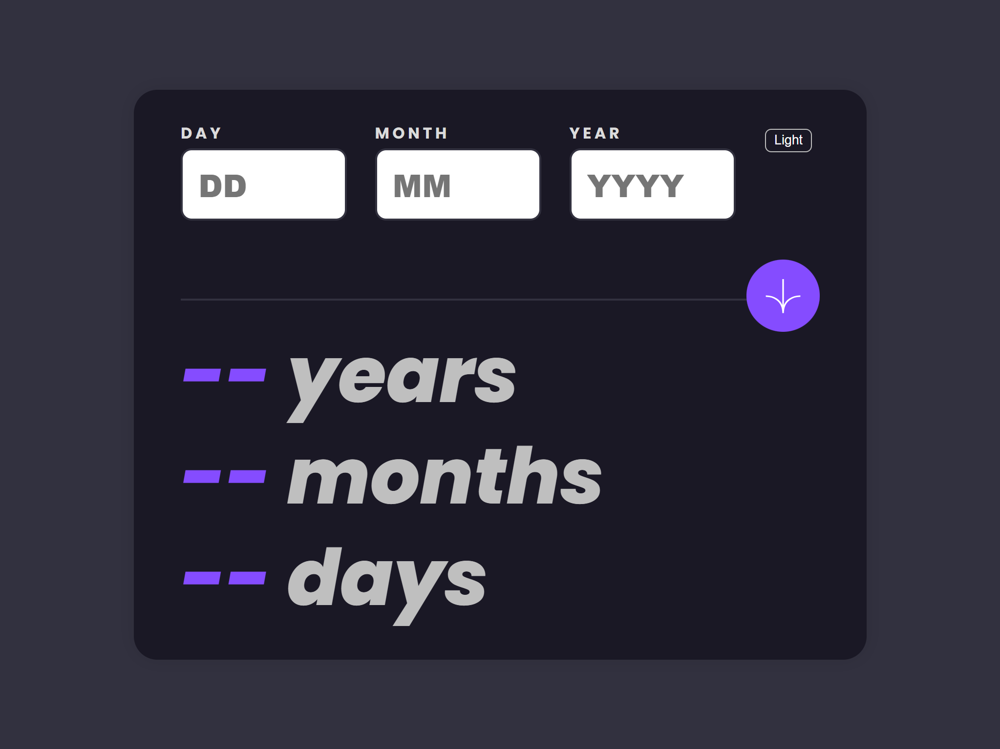
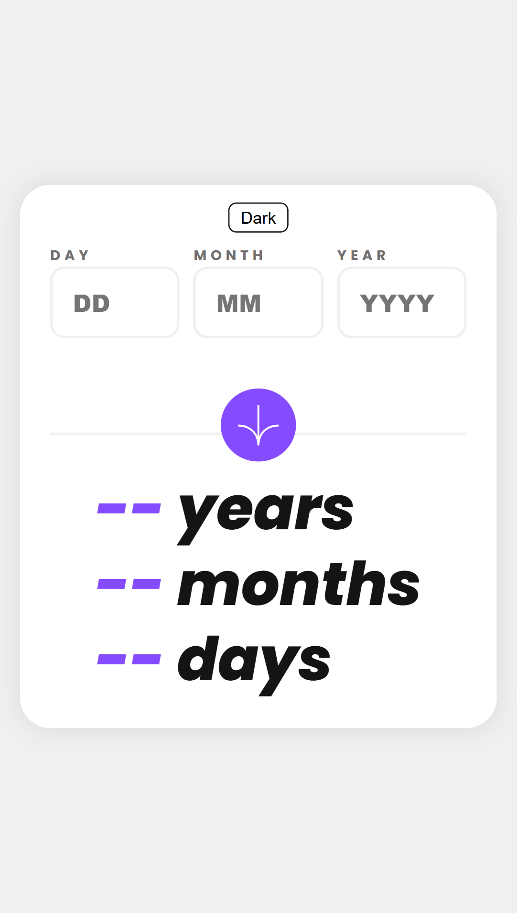
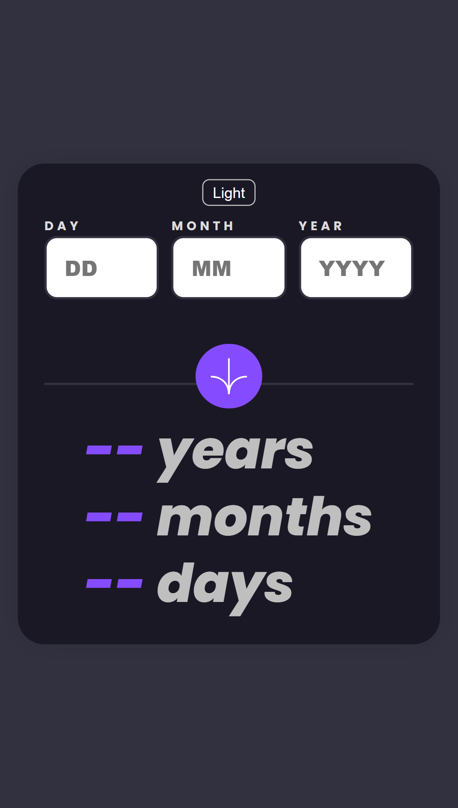

<h1 align="center">Aplicación Calculadora de Edad</h1>

<div align="center">
  <h3>
    <a href="https://age-calculater-0.netlify.app/">
      🚀 Sitio en Vivo
    </a>
    |
    <a href="https://github.com/DiegoRMV/age-calculator-app.git">
      💡 Solución
    </a>
  </h5>
</div>

<p align="center">
  Una aplicación web simple construida con HTML, CSS y JavaScript que calcula la edad de un usuario basada en su fecha de nacimiento y la fecha actual.
</p>

💻 En computadora

<a align="center" href="https://age-calculater-0.netlify.app/">
  
</a>

📱 En móvil

<a align="center" href="https://age-calculater-0.netlify.app/">
  
</a>

## El desafío

Los usuarios deberían poder:

- Ver una edad en años, meses y días después de enviar una fecha válida a través del formulario.
- Recibir errores de validación si:
  - Cualquier campo está vacío al enviar el formulario.
  - El número del día no está entre 1-31.
  - El número del mes no está entre 1-12.
  - El año está en el futuro.
  - La fecha es inválida, por ejemplo, 31/04/1991 (hay 30 días en abril).
  - La fecha de nacimiento es anterior a hoy.
- Ver el diseño óptimo para la interfaz dependiendo del tamaño de la pantalla de su dispositivo.
- Ver estados de foco y hover para todos los elementos interactivos en la página.
- Ver los números de la edad animarse a su número final cuando se envía el formulario.
- Alternar modo oscuro.

## Construido con

- Marcado HTML5 semántico.
- Propiedades personalizadas de CSS.
- JavaScript.
- Flujo de trabajo orientado a dispositivos móviles.

## Lo que aprendí

Durante el desarrollo de este proyecto tuve que obligarme a pensar de manera diferente, pude desarrollar un conjunto de habilidades de resolución de problemas más versátil que puedo aplicar a futuros proyectos.

Tambien aprendí la importancia de escribir código limpio y eficiente. Al tratar de resolver problemas rápidamente, podemos descuidar la legibilidad y la eficiencia del código. Este proyecto me enseñó a tomarme el tiempo para escribir código que sea fácil de leer y entender. Agregar comentarios para explicar lo que hace cada función y bloque de código es especialmente útil, no solo para mí, sino para cualquiera que pueda trabajar con el código en el futuro.

## Instalación

- Clona este repositorio:

```sh
git clone https://github.com/CodePapa360/Age-Calculator-app.git
```

## Autor

<b>👤 DiegoRMV</b>

- LinkedIn - [@DiegoRMV](https://www.linkedin.com/in/diego-rub%C3%A9n-menchaca-vera-ba46b9262/)
- Github: [@DiegoRMV](https://github.com/DiegoRMV)

## Muestra tu apoyo

¡Dale una ⭐️ si te gustó este proyecto!

## Agradecimientos

Un agradecimiento especial a Frontend Mentor por proporcionar una plataforma tan increíble para practicar y mejorar mis habilidades frontend. Los desafíos y proyectos disponibles en el sitio web fueron divertidos y desafiantes, y me ayudaron a aprender mucho en poco tiempo.

- FronEnd Mentor: [Age-calculator](https://www.frontendmentor.io/challenges/age-calculator-app-dF9DFFpj-Q)

## Licencia

Este proyecto está licenciado bajo la licencia MIT
